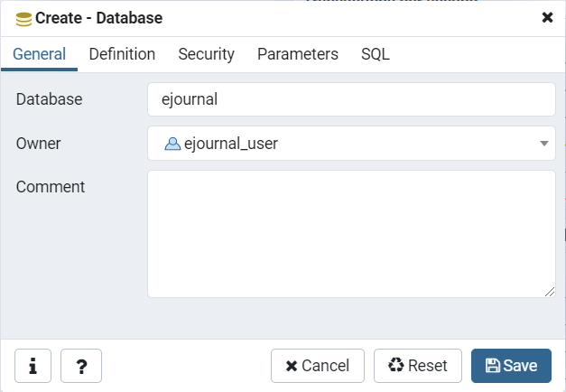
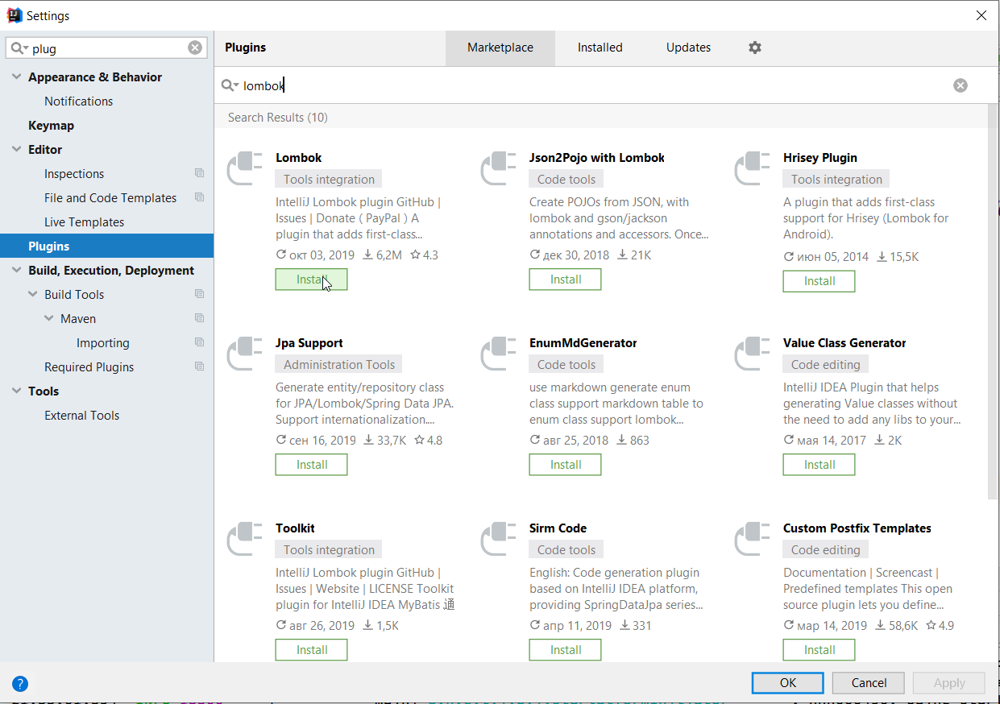
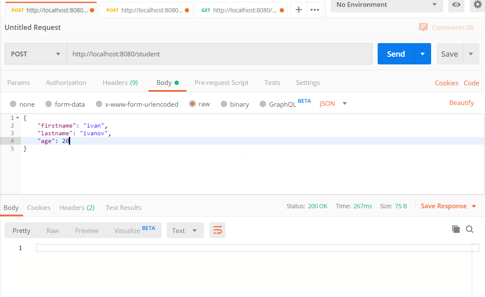
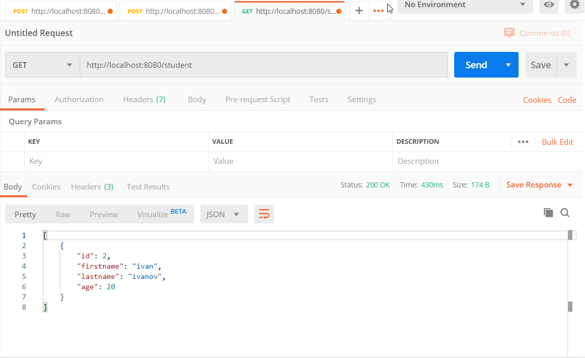
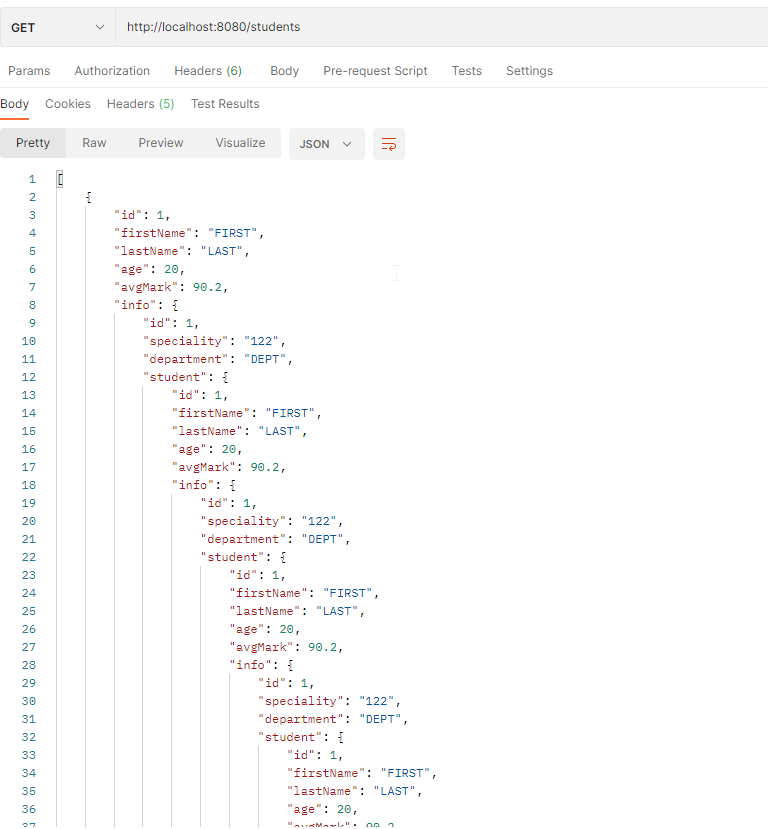
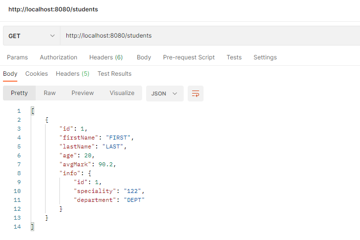
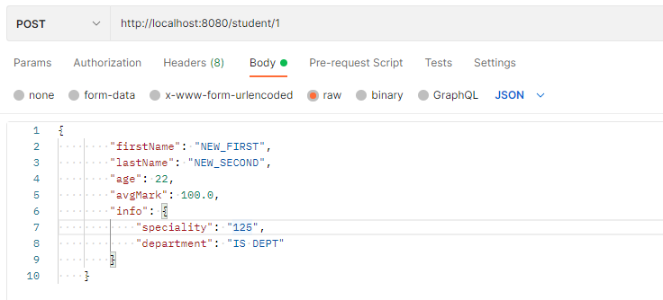

# Интеграция с СУБД. Технология ORM. Фреймворк Hibernate

В Spring имеется набор модулей для интеграции с различными технологиями хранения данных. Spring позволяет избавить разработчика от рутины при разработке программного кода, реализующего доступ к данным. Вместо возни с низкоуровневым доступом к данным можно положиться на Spring, который выполнит эту работу за вас, и сконцентрироваться на управлении данными в самом приложении.

## Что такое JDBC, драйвер, JPA, ORM и как это все между собой соотносится?

Как правило, каждая система управления базами данных (MySQL, PostgreSQL и так далее) имеет свой протокол взаимодействия с клиентами. Чтобы работать с базой данных, клиент должен соблюдать протокол взаимодействия с базой данных.

Чтобы программист не тратил время на самостоятельную реализацию протокола при разработке очередного приложения, разработчик сервера баз данных сам предоставляет всем желающим программный код, который общается с базой данных на понятном этой базе протоколе. Такой программный код и называется драйвером базы данных. Драйвер реализует протокол общения с БД и предоставляет API, которое позволяет нам общаться с базой данных, не вдаваясь в детали реализации протокола.

Как раз для этого разработчики Java предоставили стандарт **JDBC** (**Java DataBase Connectivity**) – специальное API, которое используется приложениями Java для взаимодействия с базой данных. Стандарт JDBC позволяет отправлять запросы к базе данных для выполнения операций выбора, вставки, обновления и удаления.

Если разработчики СУБД хотят, чтобы их база данных использовалась Java-разработчиками, они предоставляют JDBC-драйвер для их базы данных. Разработчики Java подключат драйвер и используют его для общения с той или иной базой данных. Если, в какой-то момент, разработчики захотят сменить СУБД, они просто меняют драйвер старой базы на драйвер новой. Благодаря стандарту JDBC, ничего менять в коде работы с базой данных не требуется.

### Что такое и зачем нужна технология ORM?

При написании объектно-ориентированного кода, который взаимодействует с базой данных, у разработчика возникает несколько проблем:

- данные в программе и в базе данных используют разные парадигмы (объектно-ориентированная и реляционная соответственно). Работу по преобразованию данных из одной парадигмы в другую ложатся на плечи программиста, что влечет за собой лишнюю работу и может приводить к ошибкам в процессе преобразования;
- программисту желательно абстрагироваться от конкретной схемы хранения данных. То есть, программисту желательно работать не с реляционной базой данных, а просто с некоторым «хранилищем», а конкретная реализация этого «хранилища» может быстро и безболезненно меняться.

 Для устранения этих проблем используется технология **ORM** (**Object-Relational Mapping**, «объектно-реляционное отображение») — технология программирования, которая связывает базы данных с концепциями объектно-ориентированных языков программирования, создавая «виртуальную объектную базу данных».

<p align="center">
  
</p>

Проще говоря, ORM – это прослойка, посредник между базой данных и объектным кодом. Используя ORM, программист не занимается формированием SQL-запросов и не думает в терминах «таблица», «записи» и «реляционные отношения», а просто работает с «хранилищем объектов» – он может туда записывать и получать объекты, не заботясь о подробностях их хранения.

В Java предусмотрен специальный стандарт **JPA** (**Java Persistence API**), который использует концепцию ORM. Существует несколько реализаций этого интерфейса, например, Hibernate, OpenJPA, EclipseLink и другие.

**Spring Data JPA** – обертка над JPA в Spring, которая предоставляет много полезных «фишек» разработчику. Она позволяет легче создавать Spring-управляемые приложения, которые используют новые способы доступа к данным, например нереляционные базы данных, map-reduce фреймворки, cloud сервисы, а так же уже хорошо улучшенную поддержку реляционных баз данных.

### Терминология JPA

Основное понятие JPA – сущность (Entity). Сущность – это Java-класс, который представляет бизнес-логику приложения и определяет данные, которые будут храниться в базе данных и извлекаться из нее.

Как правило, класс сущности представляет таблицу в базе данных, поля или свойства класса представляют собой колонки в таблице, а объект сущности представляет собой одну запись в таблице.

Важным моментом при работе с JPA являются аннотации, коих здесь будет очень много. Разберемся с некоторыми из них:

`@Entity` – позволяет серверу узнать, что это не просто какой-то класс, а сущность;
`@Id` – помечает первичный ключ в таблице. Вопрос составных ключей в данном занятии не рассматривается;
`@Table` – позволяет настраивать отображение класса в таблицу. В данном случае, мы можем указать, какое имя будет иметь соответствующая таблица в базе данных;
`@GeneratedValue` – указывает, что данное поле является генерируемым значением. Очень часто этой аннотацией помечают первичные ключи, чтобы они генерировались автоматически при добавлении новых записей в таблицу;
`@Column` – позволяет настраивать отображение колонки в таблице. В данном случае, мы можем указать, какое имя будет иметь соответствующая колонка в таблицу.

**Репозитории**. Главными компонентами для взаимодействий с БД в Spring Data являются репозитории. Каждый репозиторий работает со своим классом-сущностью.

В большинстве случаев, структура запросов к репозиторию будет одинаковая: «получить все записи», «получить записи, где столбец равен определенному значению» и так далее.

Spring Data JPA позволяет вам избежать рутинного создания запросов. Для этого вместо класса создадим интерфейс, который будет наследоваться от стандартного generic-интерфейса. Первый параметр означает тип класса-сущности, второй параметр – тип первичного ключа.

## Создание проекта и его интеграция с СУБД

Установим СУБД Postgres и запустим pgAdmin 4.

Создадим пользователя, после чего создадим базу данных для нашего приложения.

<p align="center">
  
</p>

Добавляем в `pom.xml` зависимости для работы с Spring Data JPA и JDBC драйвер для Postgres.

```xml
<dependencies>

    ...
    
    <!-- jpa, crud repository -->
    <dependency>
        <groupId>org.springframework.boot</groupId>
        <artifactId>spring-boot-starter-data-jpa</artifactId>
    </dependency>

    <!-- PostgreSQL -->
    <dependency>
        <groupId>org.postgresql</groupId>
        <artifactId>postgresql</artifactId>
    </dependency>
</dependencies>
```

Далее необходимо настроить подключение к СУБД и нужной базе данных.

Для настройки приложения Spring воспользуемся языком YAML. Для этого удалим файл `resources/application.properties` и создадим вместо него файл `application.yml`.

```xml
spring:
  jpa:
    database: POSTGRESQL
    show-sql: true
    hibernate:
      ddl-auto: create-drop
    properties:
      hibernate:
        dialect: org.hibernate.dialect.PostgreSQLDialect
  datasource:
    platform: postgres
    url: jdbc:postgresql://localhost:5432/ejournal
    username: ejournal_user
    password: 123456
    driverClassName: org.postgresql.Driver
```

Создадим класс сущности `Student`

```java
@Entity
@Table(name = "students")
public class Student {

    @Id
    @GeneratedValue(strategy = GenerationType.SEQUENCE)
    private int id;

    @Column(name = "first_name")
    private String firstName;

    @Column(name = "last_name")
    private String lastName;

    private int age;
}
```

Для уменьшения количества кода, мы будем использовать плагин `Lombok`.

Проект Lombok — это плагин компилятора, который добавляет в Java новые «ключевые слова» и превращает аннотации в Java-код, уменьшая усилия на разработку и обеспечивая некоторую дополнительную функциональность.

Lombok преобразует аннотации в исходном коде в Java-операторы до того, как компилятор их обработает: зависимость lombok отсутствует в рантайме, поэтому использование плагина не увеличит размер сборки.

При использовании Lombok наш исходный код не будет валидным кодом Java. Поэтому потребуется установить плагин для IDE, иначе среда разработки не поймёт, с чем имеет дело. Lombok поддерживает все основные Java IDE. Интеграция бесшовная. Все функции вроде «показать использования» и «перейти к реализации» продолжают работать как и раньше, перемещая вас к соответствующему полю/классу.

<p align="center">
  
</p>

Далее подключим библиотеку в `pom.xml`.

```xml
<dependencies>

    ...

    <dependency>
        <groupId>org.projectlombok</groupId>
        <artifactId>lombok</artifactId>
        <optional>true</optional>
    </dependency>
</dependencies>
```

Вернемся в класс `Student`, добавим аннотацию для геттеров, сеттеров, а также конструктор со всеми параметрами.

```java
@Entity
@Table(name = "students")
@Data
public class Student {

    @Id
    @GeneratedValue(strategy = GenerationType.SEQUENCE)
    private int id;

    @Column(name = "first_name")
    private String firstName;

    @Column(name = "last_name")
    private String lastName;

    private int age;
}
```

### Программирование слоя сервисов

`Service` – это Java класс, который содержит в себе основную бизнес-логику. В основном сервис использует готовые DAO/Repositories или же другие сервисы, для того чтобы предоставить конечные данные для пользовательского интерфейса. Сервисы, как правило, вызываются контроллерами или другими сервисами.

```java
@org.springframework.stereotype.Service
public class Service {

    public void addStudent(Student student, int id) {
        // Добавление нового студента
    }

    public List<Student> getAllStudents() {
        // Получение списка студентов
    }
}
```

Объект службы создается контейнером Spring, каждая служба является «одиночкой» (синглтоном), который создается в момент запуска приложения и уничтожается в момент закрытия приложения. Обратите внимание на аннотацию `@Service`. Этой аннотацией мы сообщаем контейнеру Spring, что это не просто класс, а класс сервиса.

Итак, мы создали службу, у которой есть два публичных метода. Первый метод добавляет нового студента, второй метод возвращает список всех студентов. В дальнейшем служба будет обращаться к объекту репозитория за данными, а пока что оставим код таким, какой он есть.

Вернемся к созданию веб-слоя. Создадим класс контроллера, создадим две конечные точки: для добавления студента и для получения списка всех студентов.

```java
@RestController
public class Controller {

    @Autowired
    private Service service;

    @PostMapping("/student")
    public void addStudent(@RequestBody Student student) {
        service.addStudent(student);
    }

    @GetMapping("/student")
    public List<Student> getAllStudents() {
        return service.getAllStudents();
    }
}
```

Обратите внимание, что мы не создаем объект службы, а получаем его «извне» с помощью аннотации `@Autowired`. Контейнер Spring «внедрит» ссылку на объект службы в поле `service`.

```java
@Entity
@Table(name = "groups")
@Data
public class Group {

    @Id
    @GeneratedValue(strategy = GenerationType.SEQUENCE)
    private int id;
    private String name;

    @OneToMany(mappedBy = "group")
    private List<Student> studentList;
}
```

### Работа с репозиторием

Главными компонентами для взаимодействий с БД в Spring Data являются репозитории. Каждый репозиторий работает со своим классом-сущностью.

В большинстве случаев, структура запросов к репозиторию будет одинаковая: «получить все записи», «получить записи, где столбец равен определенному значению» и так далее.

Spring Data JPA позволяет вам избежать рутинного создания запросов. Для этого вместо класса создадим интерфейс, который будет наследоваться от стандартного generic-интерфейса. Первый параметр означает тип класса-сущности, второй параметр – тип первичного ключа.

```java
public interface StudentRepository extends JpaRepository<Student, Integer> {
}
```

Теперь перейдем в класс службы и создадим ссылку на объект репозитория.

```java
@org.springframework.stereotype.Service
public class Service {

    @Autowired
    private StudentRepository studentRepo;

    public void addStudent(Student student) {
        studentRepo.save(student);
    }

    public List<Student> getAllStudents() {
        return studentRepo.findAll();
    }
}
```

Обратите внимание, что мы не создавали класс, который реализует интерфейс `StudentRepository`, тогда откуда мы его получим объект интерфейсного типа?

Дело в том, что Spring сгенерирует класс за нас. Этот сгенерированный класс будет иметь набор стандартных операций для работы с сущностями. В нашем случае, это операция `findAll()`, которая возвращает все сущности в таблице `student`.

Запустим сервер и выполним два клиентских запроса - один на создание студента, второй - на получение списка всех студентов.

Добавляем нового студента

<p align="center">
  
</p>

Теперь получим список всех студентов.

<p align="center">
  
</p>

### Моделирование реляционных отношений

Между двумя или более таблицами базы данных могут существовать отношения подчиненности. Отношения подчиненности определяют, что для каждой записи главной таблицы (родительской или master) может существовать одна или несколько записей в подчиненной таблице (дочерней или detail).

Существуют три разновидности связей между таблицами базы данных:

- "один-к-одному";
- "один-ко-многим";
- "многие-ко-многим".

#### Реализация отношения "один-к-одному"

Отношение "один-к-одному" имеет место, когда одной записи в родительской таблице соответствует одна запись в дочерней таблице.

Реализуем в нашем примере отношение "один-к-одному" с помощью внешнего ключа.

У нас есть сущность `Student`, создадим еще одну сущность `StudentInfo`, которая будет хранить личное дело студента. Для примера создадим несколько полей в этой сущности

```java

@Entity
@Table(name = "student_info")
@Data
public class StudentInfo {

    @Id
    @GeneratedValue(strategy = GenerationType.SEQUENCE)
    private int id;

    @Column(name = "speciality")
    private String speciality;

    @Column(name = "department")
    private String department;
}
```

Теперь перейдем в сущность `Student`. Таблица `students` будет являться родительской таблицей, поэтому чтобы создать связь, мы должны сделать следующее - мы должны добавить поле типа `StudentInfo` в сущность `Student`, после чего указать с помощью аннотаций тип связи и ее параметры.

```java
@Entity
@Table(name = "students")
@Data
public class Student {

    ...

    @OneToOne(optional = false, cascade = CascadeType.ALL)
    @JoinColumn(name = "student_info_id", referencedColumnName = "id")
    private StudentInfo info;
}
```

Прежде всего, мы видим аннотацию `@OneToOne`, которая определяет тип отношения.

Параметр `optional` говорит JPA, является ли значение в этом поле обязательным или нет.

Параметр `cascade` определяет каскадные операции. В однонаправленных отношениях только одна из сторон должна быть владельцем и нести ответственность за обновление связанных полей. В этом случае владельцем выступает сущность `Student`. Каскадирование позволяет указать JPA, что необходимо "сделать со связанным объектом при выполнении операции с владельцем". В нашем случае мы указываем, что каскадно поддерживаются все операции. То есть, если из базы будет удалена запись о студенте, в таблице `student_info` будет удалена соответствующая запись о личном деле.

Далее мы должны перейти в сущность `StudentInfo`, создать поле типа `Student` и указать нужные аннотации для установления связи.

```java
@Entity
@Table(name = "student_info")
@Data
public class StudentInfo {

    @OneToOne(mappedBy = "info")
    private Student student;
}
```

Мы опять же указываем аннотацию `@OneToOne`, но со стороны дочерней таблицы мы указываем аннотацию `mappedBy`, которое должно ссылаться на поле в сущности родительской таблицы, в которой установлена связь (в нашем случае, поле `info` в сущности `Student`).

Добавим в базу данных запись в таблице `Student` и запись в таблице `StudentInfo` и попробуем запросить список всех студентов через Postman.

<p align="center">
  
</p>

При выдаче мы получили бесконечную рекурсию. Это связано с тем, что при моделировании двустороннего отношения "один-к-одному", библиотека сериализации пытается сериализовать все свойства объекта, что приводит к бесконечному циклу. Для того, чтобы корректно обработать эту ситуацию, мы должны указать аннотацию `@JsonIgnore` для поля `student` в `StudentInfo`.

```java
@Entity
@Table(name = "student_info")
@Data
public class StudentInfo {

    ...

    @OneToOne(mappedBy = "info")
    @JsonIgnore
    private Student student;
}
```

Эта аннотация указывает, что нужно игнорировать сериализацию данного поля, что разорвет рекурсию и позволит получить нам корректные данные на клиенте.

<p align="center">
  
</p>

#### Реализация отношения "один-ко-многим"

Теперь реализуем отношение "один-ко-многим". Создадим сущность студенческой группы - класса `StudentGroup`. В студенческой группе может быть от 0 до N студентов.

```java
@Entity
@Data
@Table(name = "student_group")
public class StudentGroup {

    @Id
    @GeneratedValue(strategy = GenerationType.SEQUENCE)
    private int id;

    @Column(name = "name")
    private String name;

    private Collection<Student> students;
}
```

Согласно спецификации JPA, владельцем отношения должна быть сторона many-to-one, то есть таблица `students`.

Откроем сущность `Student`, добавим поле типа `StudentGroup` и укажем нужные аннотации.

```java
@Entity
@Table(name = "students")
@Data
public class Student {

    ...

    @ManyToOne(fetch = FetchType.LAZY, optional = false)
    @JoinColumn(name = "group_id", nullable = false)
    @JsonIgnore
    private StudentGroup studentGroup;
}
```

Аннотация `@ManyToOne` определяет тип отношения. Не забываем про аннотацию `@JsonIgnore`.

Реализуем отношение "один-ко-многим". Создадим сущность `StudentGroup` - студенческая группа. В студенческой группе может быть от 0 до N студентов. Аннотация `@JoinColumn` указывает на название колонки, которая будет служить внешним ключом.

Теперь вернемся в сущность `StudentGroup` и добавим аннотации.

```java
@Entity
@Data
@Table(name = "student_group")
public class StudentGroup {

    ...

    @OneToMany(mappedBy = "group", fetch = FetchType.EAGER)
    private Collection<Student> students;
}
```

Со стороны студенческой группы, отношение выглядит как "один-ко-многим", поэтому указываем эту аннотацию. Далее указываем стратегию загрузки (параметр `fetch`).

Для чтение связанных объектов из БД используются следующие стратегии загрузок: EAGER и LAZY. В первом случае, объекты коллекции сразу загружаются в память, во втором случае - только при обращении к ним. 

При использовании стратегии EAGER следует помнить, что если связанных объектом будет очень много, то память будет занята. В нашем случае, количество студентов в группе не может быть очень большим, поэтому можно использовать данную стратегию.

При использовании стратегии LAZY для работы с объектами тратится больше ресурсов на поддержку соединений, но экономится память.

```java
@Entity
@Data
@Table(name = "student_group")
public class StudentGroup {

    ...

    @OneToMany(mappedBy = "group", fetch = FetchType.EAGER)
    private Collection<Student> students;
}
```

Сделаем запрос с выводом всех студентов из базы.

```json
[
    {
        "id": 1,
        "firstName": "FIRST1",
        "lastName": "LAST1",
        "age": 19,
        "avgMark": 92.0,
        "info": {
            "id": 1,
            "speciality": "122",
            "department": "IS DEPT"
        }
    },
    {
        "id": 2,
        "firstName": "FIRST2",
        "lastName": "LAST2",
        "age": 22,
        "avgMark": 94.0,
        "info": {
            "id": 2,
            "speciality": "122",
            "department": "IS DEPT"
        }
    }
]
```

Теперь попробуем получить сущность группы по id.

Создадим репозиторий для студенческой группы

```java
public interface StudentRepository extends JpaRepository<Student, Integer> {}
```

Далее создадим сервис для студенческой группы

```java
@Service
public class GroupService {

    private GroupRepository repository;

    @Autowired
    public void setRepository(GroupRepository repository) {
        this.repository = repository;
    }

    public Optional<StudentGroup> getGroupById(int id) {
        return repository.findById(id);
    }
}
```

Обратите внимание, что метод репозитория возвращает тип `Optional`, который является оберткой над студенческой группой. Это связано с тем, что при поиске записи по `id`, результат может быть `null`. Для корректной обработки такой ситуации и используется тип `Optional`.

Добавим метод в класс-контроллер для получения группы по id

```java
@RestController
public class HelloController {

    private GroupService groupService;

    @Autowired
    public void setGroupService(GroupService groupService) {
        this.groupService = groupService;
    }

    ...

    @GetMapping("/group")
    public ResponseEntity<StudentGroup> getGroupById(@RequestParam(value = "id") int id) {
        Optional<StudentGroup> group = groupService.getGroupById(id);
        return group.map(ResponseEntity::ok).orElseGet(() -> ResponseEntity.status(HttpStatus.NOT_FOUND).body(null));
    }
}
```

Если мы нашли запись по `id`, тогда `Optional` будет содержать в себе объект `StudentGroup`. Если объект есть - мы передаем клиенту статус 200 и объект студенческой группы. Если объекта нет - мы возвращаем статус 404. 

Запустим приложение и получим список группы с `id=1`

```json
{
    "id": 1,
    "name": "AI-201",
    "list": [
        {
            "id": 1,
            "firstName": "FIRST1",
            "lastName": "LAST1",
            "age": 19,
            "avgMark": 92.0,
            "info": {
                "id": 1,
                "speciality": "122",
                "department": "IS DEPT"
            }
        },
        {
            "id": 2,
            "firstName": "FIRST2",
            "lastName": "LAST2",
            "age": 22,
            "avgMark": 94.0,
            "info": {
                "id": 2,
                "speciality": "122",
                "department": "IS DEPT"
            }
        }
    ]
}
```

Попробуем добавить студента. Вместе с запросом на добавление, мы должны передать - в какую группу нужно добавить студента.

Сначала добавим в контроллер метод для добавления студента. Это будет POST-запос с полями студента в теле запроса, название группы будет указано в пути запроса.

```java
@PostMapping("/student/{group_id}")
public void addStudent(@RequestBody Student student, @PathVariable(name = "group_id") int group_id) {
    studentService.addStudent(student, group_id);
}
```

Далее, в классе студенческого сервиса добавим метод `addStudent()` с двумя параметрами.

```java
@Service
public class StudentService {

    private StudentRepository repository;

    @Autowired
    public void setRepository(StudentRepository repository) {
        this.repository = repository;
    }

    private GroupRepository groupRepo;

    @Autowired
    public void setGroupRepo(GroupRepository groupRepo) {
        this.groupRepo = groupRepo;
    }

    public void addStudent(Student student, int id) {
        Optional<StudentGroup> g = groupRepo.findById(id);
        
        g.ifPresent(studentGroup -> {
            student.setStudentGroup(studentGroup);
            repository.save(student);
        });
    }
}
```

Обратите внимание на логику работы метода. Сначала, мы получаем объект студенческой группы по `id`, после чего устанавливаем "привязку" просто с помощью сеттера поля `studentGroup`. Далее, мы сохраняем студента в базе.

Проверим работу приложения. Сначала добавим студента в группу с `id = 1`. Кроме самих полей студента, мы добавляем объект `info`, который будет автоматически записан в таблицу `student_info`

<p align="center">
  
</p>

Далее получим список студенческой группы

```json
{
    "id": 1,
    "name": "AI-201",
    "list": [
        {
            "id": 1,
            "firstName": "FIRST1",
            "lastName": "LAST1",
            "age": 19,
            "avgMark": 92.0,
            "info": {
                "id": 1,
                "speciality": "122",
                "department": "IS DEPT"
            }
        },
        {
            "id": 2,
            "firstName": "FIRST2",
            "lastName": "LAST2",
            "age": 22,
            "avgMark": 94.0,
            "info": {
                "id": 2,
                "speciality": "122",
                "department": "IS DEPT"
            }
        },
        {
            "id": 3,
            "firstName": "NEW_FIRST",
            "lastName": "NEW_SECOND",
            "age": 22,
            "avgMark": 100.0,
            "info": {
                "id": 3,
                "speciality": "125",
                "department": "IS DEPT"
            }
        }
    ]
}
```

#### Реализация отношения "многие-ко-многим"

Добавим сущность `StudentClub` (студенческий кружок). Студент может одновременно состоять в нескольких кружках, один кружок вмещает в себя несколько студентов.

Создадим класс `StudentClub`, добавим коллекцию студентов и пометим ее аннотацией `@ManyToMany`.

```java
@Data
@Entity
@Table(name="student_club")
public class StudentClub {

    @Id
    @GeneratedValue(strategy = GenerationType.SEQUENCE)
    private int id;

    @Column(name = "name")
    private String name;

    @ManyToMany
    private Set<Student> students;
}
```

То же сделаем и с классом `Student`

```java
@Entity
@Table(name = "student")
@Data
public class Student {

    ...

    @ManyToMany
    @JsonIgnore
    private Set<StudentClub> clubs;
}
```

Далее нам необходимо настроить связь. Как мы знаем, отношение многие-ко-многим моделируется с помощью отдельной таблице, каждая запись которой содержит ключи к записям двух таблиц. Эти ключи являются одновременно первичным и внешними.

В качестве владельца отношения выберем студенческий кружок. Нам не надо создавать вручную третью таблицу, за нас это сделает Spring JPA. Нам нужно указать аннотацию `@JoinTable` и определить параметры новой таблицы.

```java
@Data
@Entity
@Table(name="student_club")
public class StudentClub {

    @Id
    @GeneratedValue(strategy = GenerationType.SEQUENCE)
    private int id;

    @Column(name = "name")
    private String name;

    @ManyToMany
    @JoinTable(
            name = "club_student",
            joinColumns = @JoinColumn(name = "club_id"),
            inverseJoinColumns = @JoinColumn(name = "student_id")
    )
    private Set<Student> students;
}
```

В параметре name указываем название таблицы, в параметр `joinColumns` указываем название колонки, которая будет содержать ключ записи `StudentClub`. Параметр `inverseJoinColumns` указывает название колонки, которая будет содержать ключ записи `Student`.

В классе `Student` запишем параметр `mappedBy`, где укажем название поля в классе `StudentClub`.

```java
@Entity
@Table(name = "student")
@Data
public class Student {

    ...

    @ManyToMany (mappedBy = "students")
    private Set<StudentClub> clubs;

    @JsonIgnore
    public List<StudentClub> getClubs() {
        return clubs;
    }
}
```

Иногда можно столкнуться с ситуацией, когда библиотека Jackson некорректно обрабатывает аннотацию `@JsonIgnore`, которая применяется к полю. В этом случае можно установить аннотацию для геттера и сеттера. В нашем случае, необходимо установить аннотацию только для геттера.

Добавим метод контроллера для получения списка студентов

```java
@RestController
public class HelloController {

    private StudentService studentService;
    private GroupService groupService;
    private ClubService clubService;

    ...
    
    @GetMapping("/clubs")
    public List<StudentClub> getAllClubs() {
        return clubService.getAllClubs();
    }
}
```

службу

```java
@Service
public class ClubService {

    private ClubRepository repository;

    @Autowired
    public ClubService(ClubRepository repository) {
        this.repository = repository;
    }

    public List<StudentClub> getAllClubs() {
        return repository.findAll();
    }
}
```

и репозиторий для студенческого кружка

```java
public interface ClubRepository extends JpaRepository<StudentClub, Integer> {}
```

Добавим через pgAdmin студентов и студенческие кружки и посмотрим на результат запроса на получение всех кружков.

```json
[
    {
        "id": 1,
        "name": "Machine Learning",
        "studentSet": [
            {
                "id": 1,
                "firstName": "FIRST1",
                "lastName": "LAST1",
                "age": 19,
                "avgMark": 92.0,
                "info": {
                    "id": 1,
                    "speciality": "122",
                    "department": "IS DEPT"
                }
            },
            {
                "id": 9,
                "firstName": "NEW_FIRST",
                "lastName": "NEW_SECOND",
                "age": 22,
                "avgMark": 100.0,
                "info": {
                    "id": 10,
                    "speciality": "125",
                    "department": "IS DEPT"
                }
            }
        ]
    },
    {
        "id": 2,
        "name": "Robots",
        "studentSet": [
            {
                "id": 2,
                "firstName": "FIRST2",
                "lastName": "LAST2",
                "age": 22,
                "avgMark": 94.0,
                "info": {
                    "id": 2,
                    "speciality": "122",
                    "department": "IS DEPT"
                }
            },
            {
                "id": 9,
                "firstName": "NEW_FIRST",
                "lastName": "NEW_SECOND",
                "age": 22,
                "avgMark": 100.0,
                "info": {
                    "id": 10,
                    "speciality": "125",
                    "department": "IS DEPT"
                }
            }
        ]
    }
]
```