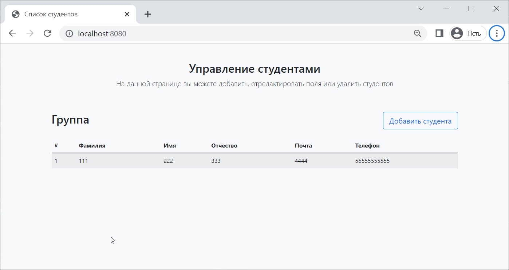

# Фреймворк Spring MVC. Создание MVC-приложения. Создание представлений с помощью Thymeleaf

Spring MVC – веб-фреймворк, призванный упростить разработку веб-приложений. Опираясь на шаблон модель–представление–контроллер (Model-View-Controller, MVC), фреймворк Spring MVC помогает строить веб-приложения, столь же гибкие и слабо связанные, как сам фреймворк Spring.

Паттерн MVC разделяет обязанности приложения (логика ввода, бизнес-логика и логика UI), обеспечивая при этом свободную связь между ними.

- **Model** (модель) - инкапсулирует данные приложения. Данные, в целом, будут состоять из java-бинов;
- **View** (представление) - отвечает за отображение данных модели, как правило, в виде HTML-страниц, которые пользователь видит в браузере;
- **Controller** (контроллер) - обрабатывает запрос пользователя, создает соответствующую Модель и передает ее для отображения в Представление.

## Схема работы фреймворка Spring MVC

Логика работы Spring MVC построена вокруг технологии сервлетов и класса DispatcherServlet, который принимает и обрабатывает все HTTP-запросы и ответы на них.

<p align="center">
  
</p>

Рассмотрим последовательность событий, связанных с пришедшим HTTP-запросом:

1. после получения HTTP-запроса, `DispatcherServlet` обращается к `HandlerMapping`, который определяет, какой **Контроллер** должен быть вызван, после чего отправляет запрос в нужный **Контроллер**;
2. **Контроллер** принимает запрос и вызывает соответствующий метод обработки, в зависимости от HTTP-метода (как правило, `GET` или `POST`). Метод определяет данные **Модели** на основании бизнес-логики приложения и возвращает название **Представления** обратно в `DispatcherServlet`;
3. с помощью `ViewResolver`, `DispatcherServlet` определяет, какое **Представление** нужно использовать для отображения данных;
4. после того, как **Представление** было создано, `DispatcherServlet` отправляет данные **Модели** в **Представление**, которое в конечном итоге отображается в браузере.

Краткое описание схемы работы Spring MVC звучит следующим образом:

1. вначале `DispatcherServlet` (диспетчер сервлетов) получает запрос, далее он смотрит свои настройки, чтобы понять какой контроллер использовать (на рисунке Handler Mapping);
2. после получения имени контроллера запрос передается на обработку в этот контроллер (на рисунке **Controller**). В контроллере происходит обработка запроса и обратно посылается **ModelAndView** (модель — сами данные; view (представление) — как эти данные отображать);
3. `DispatcherServlet` на основании полученного **ModelAndView**, должен определить, какое представление будет выводить данные. Для этого используется арбитр представлений (View Resolver), который на основании полученного логического имени представления возвращает ссылку на файл View;
4. в представление передаются данные (Model) и обратно, если необходимо, посылается ответ от представления.

Рассмотренную выше схему работы фреймворка можно также представить следующей диаграммой

<p align="center">
  
</p>

## Пример проекта Spring MVC

Создадим новый Spring Boot проект с подключением модулей Spring Web и Thymeleaf.

<p align="center">
  
</p>

В открытом проекте нас интересуют директории `static` и `templates`.

<p align="center">
  
</p>

В директории `static` должны храниться **статические файлы**.

Статическим содержимым является любое содержимое, которое доставляется конечному пользователю без необходимости быть сгенерированным, модифицированным или обработанным.

В нашем случае, таким контентом могут быть изображения, различные файлы, css-стили и так далее.

В директории `templates` хранятся **шаблоны** - статические прототипы, которые будут использованы для генерации динамического контента.

Грубо говоря, шаблоны представляют собой файлы, которые считывает движок Thymeleaf и комбинирует с объектами Java, чтобы сгенерировать итоговый документ (HTML, CSS и так далее).

Spring Boot предоставляет авто-конфигурацию для Spring MVC, которая включает наиболее популярные настройки приложения. Среди прочего, авто-конфигурация позволяет автоматически обрабатывать файл `index.html`.

Добавим в директорию templates файл `index.html` со следующим содержимым

```html
<!DOCTYPE html>
<html lang="en" xmlns:th="http://www.thymeleaf.org">
<head>
    <meta charset="UTF-8" >
    <title>Index page</title>
</head>
<body>
<h1>Hello, Spring MVC!</h1>
</body>
</html>
```

Запустим приложение, откроем окно браузера и посмотрим на результат.

<p align="center">
  
</p>

Таким образом, нам не надо было писать контроллер для обработки запроса - мы воспользовались вариантом, предоставленным Spring Boot.

От встроенного контроллера мало пользы, когда нам необходимо добавить динамический контент в HTML-шаблон.

Попробуем принять запрос с параметром и использовать этот параметр для генерации динамической HTML-страницы.

Создадим класс контроллера, которой будет обрабатывать запрос с относительным путем `"\"`.

```java
@Controller
public class HelloController {

    @GetMapping("/")
    public String hello(
            @RequestParam(name = "name") String name,
            Model model) {
        model.addAttribute("name", name);
        return "index";
    }
}
```

Аннотация `@GetMapping` нам уже понятна. Когда мы вводим в поле адреса URL, то данный запрос отсылается с методом `GET`.

С помощью аннотации `@RequestParam` обрабатываем входящий параметр, который передается в строке адреса. Новыми для нас являются атрибуты `required` и `defaultValue`. Атрибут `required` определяет - обязательно ли для успешной обработки запроса наличие входного параметра `name`. Атрибут `defaultValue` определяет значение параметра по умолчанию, если он не будет передан.

Если мы уберем атрибуты `required` и `defaultValue` и попробуем прислать запрос без параметра, сервер вернет ошибку 400.

<p align="center">
  
</p>

Далее нас интересует очень интересный входной аргумент типа `Model`. Метод контроллера может принять на вход аргумент типа `Model`, который служит контейнером для пар "ключ"-"значение". Мы можем поместить в этот контейнер нужную нам информацию, которая потом будет использована в шаблоне для создания динамической веб-странице.

В данном случае, мы считываем значение входного параметра и добавляем в контейнер с помощью метода `addAttribute()`.

Далее, мы возвращаем строку с названием `"index"`. В составе `DispatcherServlet` имеется объект `ViewResolver`, который по названию строки определяет шаблон для Thymeleaf. В данном случае, строка `"index"` означает, что объект ViewResolver будет использовать шаблон `index.html`.

Далее, нам необходимо исправить файл `index.html` и добавить туда код для генерации динамического содержимого. Отредактируем файл `index.html`

```html
<!DOCTYPE html>
<html lang="en" xmlns:th="http://www.thymeleaf.org">
<head>
    <meta charset="UTF-8">
    <title>Index page</title>
</head>
<body>
    <h1 th:text="'Hello, '+ ${name} + '!'"/>
</body>
</html>
```

Обратите внимание на атрибут `th:text`. Это специальны атрибут Thymeleaf, который вычисляет выражение внутри атрибута и помещает его в тело тега.

После этого запускаем приложение. Попробуем добавить параметр с именем

<p align="center">
  
</p>

А так выглядит результат без параметра

<p align="center">
  
</p>

## Создание приложения для Spring MVC

Попробуем более практичное приложение для Spring MVC. Создадим шаблоны для двух страниц. Первая страница будет выводить список студентов и содержать кнопку "Добавить", которая будет добавлять студента в список.

Для начала создадим шаблон для вывода списка студентов. Для создания шаблона воспользуемся фреймворком Bootstrap. Создадим следующий шаблон для страницы `index.html`

```html
<!doctype html>
<html lang="en" xmlns:th="http://www.thymeleaf.org">
<head>
    <meta charset="utf-8">
    <meta name="viewport" content="width=device-width, initial-scale=1, shrink-to-fit=no">

    <!-- Bootstrap CSS -->
    <link href="https://cdn.jsdelivr.net/npm/bootstrap@5.1.3/dist/css/bootstrap.min.css"
          rel="stylesheet" integrity="sha384-1BmE4kWBq78iYhFldvKuhfTAU6auU8tT94WrHftjDbrCEXSU1oBoqyl2QvZ6jIW3"
          crossorigin="anonymous">

    <title>Список студентов</title>
</head>
<body class="bg-light">
<div class="container">

    <div class="py-5 text-center">
        <h2>Управление студентами</h2>
        <p class="lead">На данной странице вы можете добавить, отредактировать поля или удалить студентов</p>
    </div>

    <div class="row">
        <div class="col">
            <h2>Группа</h2>
        </div>
        <div class="col col-lg-3 text-end">
            <a href="#" class="btn btn-lg btn-block btn-outline-primary"
               role="button"
               aria-disabled="true">Добавить студента</a>
        </div>
    </div>

    <br/>

    <div class="table-responsive">
        <table class="table table-striped">
            <thead>
            <tr>
                <th class="text-justify">#</th>
                <th class="text-justify">Фамилия</th>
                <th class="text-justify">Имя</th>
                <th class="text-justify">Отчество</th>
                <th class="text-justify">Почта</th>
                <th class="text-justify">Телефон</th>
            </tr>
            </thead>
            <tbody>
            <tr>
                <td class="align-middle"></td>
                <td class="align-middle"></td>
                <td class="align-middle"></td>
                <td class="align-middle"></td>
                <td class="align-middle"></td>
                <td class="align-middle"></td>
            </tr>
            </tbody>
        </table>
    </div>
</div>

<script src="https://cdn.jsdelivr.net/npm/bootstrap@5.1.3/dist/js/bootstrap.bundle.min.js"
        integrity="sha384-ka7Sk0Gln4gmtz2MlQnikT1wXgYsOg+OMhuP+IlRH9sENBO0LRn5q+8nbTov4+1p"
        crossorigin="anonymous"></script>
</body>
</html>
```

Веб-страница выглядит следующим образом

<p align="center">
  
</p>

Далее создадим шаблон в файле `add_student.html`

```html
<!doctype html>
<html lang="en" xmlns:th="http://www.thymeleaf.org">
<head>
    <meta charset="utf-8">
    <meta name="viewport" content="width=device-width, initial-scale=1, shrink-to-fit=no">

    <!-- Bootstrap CSS -->
    <link href="https://cdn.jsdelivr.net/npm/bootstrap@5.1.3/dist/css/bootstrap.min.css"
          rel="stylesheet" integrity="sha384-1BmE4kWBq78iYhFldvKuhfTAU6auU8tT94WrHftjDbrCEXSU1oBoqyl2QvZ6jIW3"
          crossorigin="anonymous">

    <title>Добавление студента</title>
</head>
<body class="bg-light">
<div class="container">
    <div class="py-5 text-center">
        <h2>Добавление студента</h2>
        <p class="lead">Заполните поля и нажмите кнопку 'Добавить студента'</p>
    </div>

    <form method="post">
        <div class="row">
            <div class="col-md-12">
                <h4 class="mb-3">Поля для заполнения</h4>
                <div class="row">
                    <div class="col-md-4 mb-3">
                        <label for="lastName">Фамилия</label>
                        <input type="text" class="form-control" id="lastName" placeholder=""
                               value="">
                    </div>
                    <div class="col-md-4 mb-3">
                        <label for="firstName">Имя</label>
                        <input type="text" class="form-control" id="firstName" placeholder=""
                               value="">
                    </div>
                    <div class="col-md-4 mb-3">
                        <label for="patronymic">Отчество</label>
                        <input type="text" class="form-control" id="patronymic" placeholder=""
                               value="">
                    </div>
                </div>
                <div class="mb-3">
                    <label for="email">Электронная почта</label>
                    <input type="email" class="form-control" id="email"
                           placeholder="" value="">
                </div>
                <div class="mb-3">
                    <label for="phone">Телефон</label>
                    <input type="text" class="form-control" id="phone"
                           placeholder="(ХХХ) ХХХ-ХХХХ" value="">
                </div>
                <hr class="mb-4">
                <button class="btn btn-primary btn-lg btn-block" type="submit" value="Submit">Добавить студента</button>
            </div>
        </div>
    </form>
</div>

<br/>

<script src="https://cdn.jsdelivr.net/npm/bootstrap@5.1.3/dist/js/bootstrap.bundle.min.js"
        integrity="sha384-ka7Sk0Gln4gmtz2MlQnikT1wXgYsOg+OMhuP+IlRH9sENBO0LRn5q+8nbTov4+1p"
        crossorigin="anonymous"></script>
</body>
</html>
```

Веб-страница выглядит следующим образом

<p align="center">
  
</p>

Шаблоны мы будем в дальнейшем редактировать, а сейчас необходимо реализовать следующий функционал - при нажатии кнопки "Добавить студента" в `index.html` открывается страница `add_student.html` с формой добавления.

Для начала создадим класс контроллера с методами обработки запросов. На данный момент, класс контроллера будет простым

```java
@Controller
public class StudentController {

    @GetMapping("/")
    public String index(Model model) {
        return "index";
    }

    @GetMapping("/add_student")
    public String addStudent(Model model) {
        return "add_student";
    }
}
```

Далее отредактируем шаблон `index.html`, добавим в тег гиперссылки атрибут `th:href`, который сгенерирует гиперссылку с указанием относительного пути

```html
<a th:href="@{~/add_student}" class="btn btn-lg btn-block btn-outline-primary"
    role="button"
    aria-disabled="true">Добавить студента</a>
```

Запустим приложение и убедимся, что всё работает корректно.

Далее нам необходимо подключить СУБД для работы с данными о студентах. Вопрос подключения СУБД был подробно рассмотрен в прошлой лекции, так что просто дадим краткое описание действий.

Сначала добавим в проект библиотеки для JDBC-драйвера и для Hibernate.

```xml
<project ...>

    ...

    <dependencies>
        <dependency>
            <groupId>org.springframework.boot</groupId>
            <artifactId>spring-boot-starter-thymeleaf</artifactId>
        </dependency>
        <dependency>
            <groupId>org.springframework.boot</groupId>
            <artifactId>spring-boot-starter-web</artifactId>
        </dependency>

        <!-- JDBC driver -->
        <dependency>
            <groupId>org.postgresql</groupId>
            <artifactId>postgresql</artifactId>
        </dependency>

        <!-- JPA -->
        <dependency>
            <groupId>org.springframework.boot</groupId>
            <artifactId>spring-boot-starter-data-jpa</artifactId>
            <version>2.6.4</version>
        </dependency>
    </dependencies>
    
    ...

</project>
```

Далее создадим файл в формате YAML `application.yml` с настройками подключения. Напоминаем, что данный файл должен находиться в директории `resources`

```yml
spring:
  jpa:
    database: POSTGRESQL
    show-sql: true
    hibernate:
      ddl-auto: create-drop
    properties:
      hibernate:
        dialect: org.hibernate.dialect.PostgreSQLDialect
  datasource:
    platform: postgres
    url: jdbc:postgresql://localhost:5432/test_database
    username: postgres
    password: 12345
    driverClassName: org.postgresql.Driver
```

После этого нам необходимо добавить сущность `Student`, сервис и репозиторий.

```java
@Entity
@Table(name = "students")
public class Student {

    @Id
    @GeneratedValue(strategy = GenerationType.IDENTITY)
    private int id;

    @Column(name = "first_name")

    private String firstName;

    @Column(name = "last_name")
    private String lastName;

    @Column(name = "patronymic")
    private String patronymic;

    @Column(name = "email")
    private String email;

    @Column(name = "phone")
    private String phone;

    // конструкторы, геттеры и сеттеры
}
```

```java
@Service
public class StudentService {

    private StudentRepository repository;

    @Autowired
    public void setRepository(StudentRepository repository) {
        this.repository = repository;
    }

    public void addStudent(Student student) {
        repository.save(student);
    }

    public List<Student> getAllStudents() {
        return repository.findAll();
    }
}
```

```java
public interface StudentRepository extends JpaRepository<Student, Integer>, JpaSpecificationExecutor<Student> {
}
```

Для начала давайте реализуем следующий функционал: на странице `index.html` должна быть показана информация о студентах. Информацию берем из таблицы `students` из базы данных.

Для начала отредактируем метод контроллера, который отвечает за `GET` с адресом `"/"`.

```java
@Controller
public class StudentController {

    private StudentService service;

    @Autowired
    public void setService(StudentService service) {
        this.service = service;
    }

    ...

    @GetMapping("/")
    public String index(Model model) {
        List<Student> list = service.getAllStudents();
        model.addAttribute("students", list);
        return "index";
    }
}
```

Мы "подключили" сервис для сущности `Student`, а в самом методе просто получаем из сервиса список студентов и устанавливаем его как данные модели, после чего указываем представление `"index"`.

Далее нам необходимо отредактировать шаблон `index.html`. Данные о студентах выводятся в таблице, изначально она выглядит так

```html
<div class="table-responsive">
    <table class="table table-striped">
        <thead>
        <tr>
            <th class="text-justify">#</th>
            <th class="text-justify">Фамилия</th>
            <th class="text-justify">Имя</th>
            <th class="text-justify">Отчество</th>
            <th class="text-justify">Почта</th>
            <th class="text-justify">Телефон</th>
        </tr>
        </thead>
        <tbody>
        <tr>
            <td class="align-middle"></td>
            <td class="align-middle"></td>
            <td class="align-middle"></td>
            <td class="align-middle"></td>
            <td class="align-middle"></td>
            <td class="align-middle"></td>
        </tr>
        </tbody>
    </table>
</div>
```

Фактически, для каждого студента из списка, мы должны создать свой тег `<tr>` (строка таблице), а каждая колонка (тег `<td>`) должна выводить то или иное поле отдельного студента. Мы можем реализовать эту логику следующим образом

```html
<div class="table-responsive">
    <table class="table table-striped">
        <thead> ... </thead>
        <tbody>
        <tr th:each="student : ${students}">
            <td class="align-middle"><span th:text="${student.id}"/></td>
            <td class="align-middle"><span th:text="${student.lastName}"/></td>
            <td class="align-middle"><span th:text="${student.firstName}"/></td>
            <td class="align-middle"><span th:text="${student.patronymic}"/></td>
            <td class="align-middle"><span th:text="${student.email}"/></td>
            <td class="align-middle"><span th:text="${student.phone}"/></td>
        </tr>
        </tbody>
    </table>
</div>
```

Атрибут `th:each` проитерирует коллекцию `students`, для каждого элемента из коллекции будет добавлен свой тег `<tr>` с содержимым внутри. Далее, в тег `<span>` мы добавляем атрибут `th:text` и указываем, какое поле i-го студента нужно выводить в этом теге.

Если вы используете PostgreSQL, то можно воспользоваться pgAdmin4, чтобы добавить данные в таблицу, после чего можно проверить корректность работы нашего приложения (помните, что в нашем случае мы добавляем данные ПОСЛЕ запуска веб-приложения, так как в файле `application.yml` мы указали режим DDL как `create-drop`).

Проверим работу приложения.

<p align="center">
  
</p>

Далее нам необходимо реализовать функционал ввода данных формы и сохранение добавленного студента в базу данных.

Сначала отредактируем класс контроллера

```java
@GetMapping("/add_student")
public String addStudent(Model model) {
    model.addAttribute("student", new Student());
    return "add_student";
}

@PostMapping("/")
public String processAddStudentForm(Student student) {
    service.addStudent(student);
    return "redirect:/";
}
```

Прежде всего, мы создали обработчик GET-запроса, по которому открывается окно формы. Для того, чтобы сохранить данные формы в объекте студента, мы передаем в модель новый объект студента, поля которого потом будут заполнены данными из формы.

После того, как пользователь нажимает на кнопку "Сохранить студента", браузер переходит обратно на страницу, поэтому данные формы поступят по адресу `"/"`.

Мы обрабатываем POST-запрос и на входе к нам поступит объект класса `Student` из формы. При поступлении мы добавляем студента через сервис в базу данных.

Важно, что мы должны сделать редирект на страницу `"\"`. Это делается, чтобы при повторном GET-запросе, мы смогли получить данные о новом студенте.

Далее необходимо отредактировать тэг формы в шаблоне `add_student.html`. Прежде всего, мы указываем тег `th:action="@{\}"`, который говорит о том, что мы перейдем в корень нашего приложения. Далее, мы указываем объект, в поля которого мы будем записывать данные из формы. Этот объект мы передавали в методе контроллера.

```html
<form method="post" enctype="multipart/form-data" action="#" th:action="@{/}" th:object="${student}">

...

</form>
```

Далее, для каждого поля формы, мы указываем атрибут `th:field`, который создает привязку поля формы и атрибута объекта. Значение атрибута - имя поля объекта.

```html
<form method="post" enctype="multipart/form-data" action="#" th:action="@{/}" th:object="${student}">

    <label for="lastName">Фамилия</label>
    <input th:field="*{lastName}" ...>

    <label for="firstName">Имя</label>
    <input th:field="*{firstName}" ...>

    <label for="patronymic">Отчество</label>
    <input th:field="*{patronymic}" ...>

    <label for="email">Электронная почта</label>
    <input th:field="*{email}" >

    <label for="phone">Телефон</label>
    <input th:field="*{phone}">

    <button class="btn btn-primary btn-lg btn-block" type="submit" value="Submit">Добавить студента</button>
</form>
```

Запустим приложение и проверим корректность добавления данных.

<p align="center">
  
</p>

<p align="center">
  
</p>

### Валидация данных формы

Очень часто, при заполнении форм, необходимо соблюсти определенные ограничения на вводимые данные. Для этого, в составе Hibernate есть библиотека `hibernate-validator`, которая позволяет осуществлять валидацию формы.

Ограничения, накладываемые на поля формы, описываются в виде аннотаций для полей класса.

Откроем сущность `Student` и добавим аннотации для полей.

```java
@Entity
@Table(name = "students")
public class Student {

    @Id
    @GeneratedValue(strategy = GenerationType.IDENTITY)
    private int id;

    @Column(name = "first_name")
    @Size(min = 2, max = 50, message = "First name should be from 2 to 50 characters")
    private String firstName;

    @Column(name = "last_name")
    @Size(min = 2, max= 50, message = "Last name should be from 2 to 50 characters")
    private String lastName;

    @Column(name = "patronymic")
    @Size(min = 2, max= 50, message = "Patronymic should be from 2 to 50 characters")
    private String patronymic;

    @Column(name = "email")
    @Pattern(regexp = "^[\\w-\\.]+@([\\w-]+\\.)+[\\w-]{2,4}$", message = "email format is invalid")
    private String email;

    @Column(name = "phone")
    @Size(min = 8, max= 20, message = "Phone should be from 8 to 20 characters")
    private String phone;
```

Для большинства полей мы указали минимальную и максимальную длину поля, а также указали сообщение, которое будет выведено, если поле не пройдет валидацию. Для поля `email` мы указали регулярное выражение.

Далее, откроем контроллер и отредактируем метод `processAddStudentForm()`.

```java
@PostMapping("/")
public String processAddStudentForm(@Valid Student student, BindingResult result) {

    if (result.hasErrors()) {
        System.out.println("Validation has been failed!");
        return "add_student";
    }

    service.addStudent(student);
    return "redirect:/";
}
```

Для валидации сущности 'Student' необходимо указать аннотацию `@Valid`, далее мы принимаем на вход объект `BindingResult`, в котором содержится информация о результате валидации. Логика метода проста - мы вызываем метод `hasErrors()`, который возвращает `true`, если при валидации формы возникли ошибки. В этом случае мы возвращаемся обратно в форму. Если ошибок не было - сохраняем студента в базу и выполняем переадресацию.

Последний этап - изменение представления `add_student.html`. Для того, чтобы проинформировать пользователя о том, что поле не прошло валидацию - мы хотим показать надпись с ошибкой под полем ввода. Для этого добавим в шаблон следующий код (пример для поля `firstName`)

```html
<label for="lastName">Фамилия</label>
<input th:field="*{lastName}" type="text" class="form-control" id="lastName" placeholder=""
        value="">
        <small class="text-danger" th:if="${#fields.hasErrors('lastName')}" th:errors="*{lastName}"/>
```

Мы добавили тег `small`, который выводит маленький текст. Далее мы используем атрибут `th:if`. Если логическое выражение в атрибуте будет `true`, то содержимое тега будет показано на экране. Таким образом, содержимое тега `small` будет показано только тогда, когда будут ошибки валидации в соответствующем поле. Текст для тега `small` определяется с помощью атрибута `th:errors`. Он выводит ошибку для соответствующего поля.

Повторяем данный код для каждого из полей ввода, запускаем приложение и проверяем результат.

<p align="center">
  
</p>

В директории **files** добавлены файлы классов и шаблонов для данного проекта.
